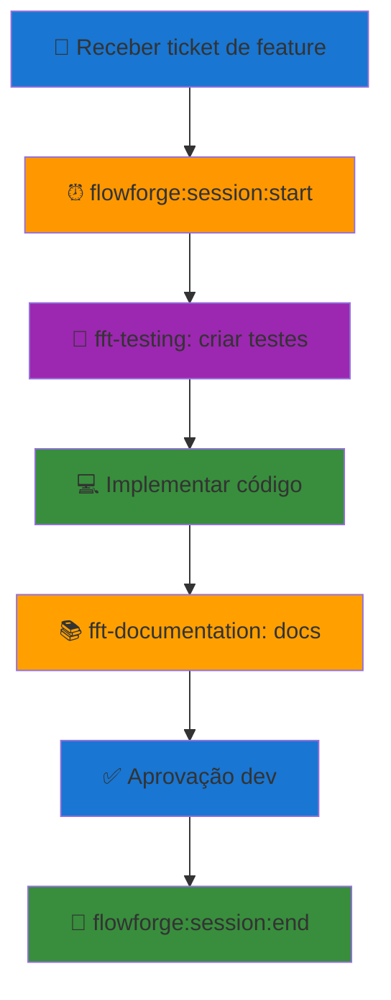
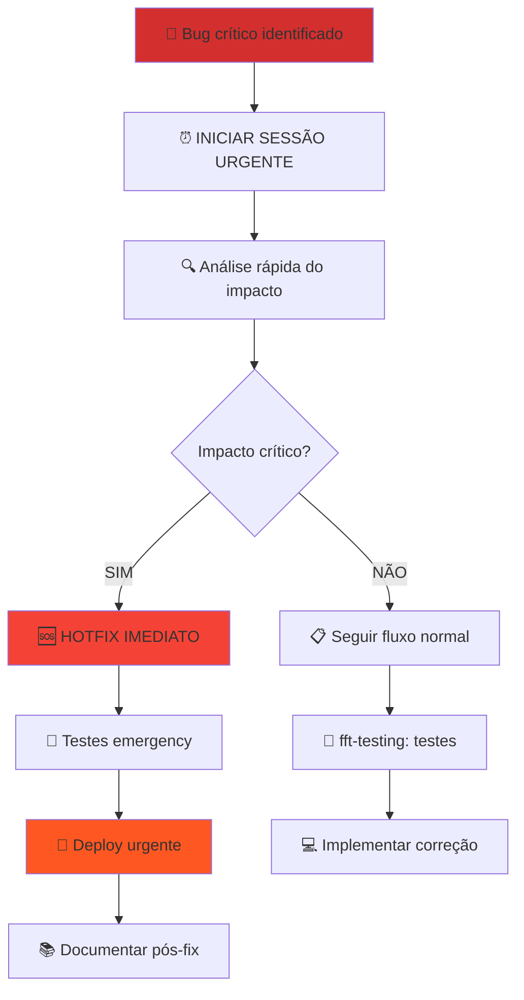
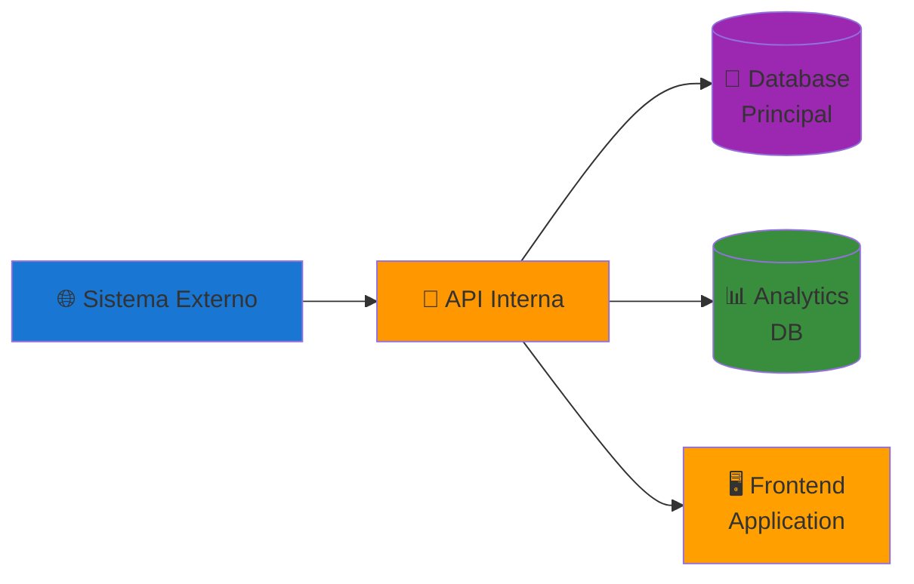

# ⚡ FlowForge - Quick Reference

<div align="center">


</div>

## 🎭 **VOCÊ É O MAESTRO FLOWFORGE**

```
╔══════════════════════════════════════════════════════════════╗
║                                                              ║
║  VOCÊ NÃO CODIFICA. VOCÊ NÃO TRABALHA DIRETAMENTE NO CÓDIGO ║
║                                                              ║
║  SUA RESPONSABILIDADE É:                                     ║
║  • ORQUESTRAR agentes especializados (fft-*)                ║
║  • DELEGAR funções para especialistas                       ║
║  • REPORTAR toda e qualquer alteração ao desenvolvedor      ║
║                                                              ║
╚══════════════════════════════════════════════════════════════╝
```

Este documento é a **referência rápida para orquestração FlowForge** - use-o para localizar documentação completa e coordenar os agentes especializados de forma eficiente.

Referência ultra-rápida (<30 segundos) para comandos FlowForge e regras críticas para qualquer projeto usando FlowForge.

---

## 📋 **Índice Rápido**

1. [**🚀 Comandos Essenciais**](#-comandos-essenciais) - Top 80/20 comandos
2. [**📊 Top 10 Regras Críticas**](#-top-10-regras-críticas) - Zero tolerância
3. [**🔄 Workflows Genéricos**](#-workflows-genéricos) - Fluxos universais
4. [**🔗 Navegação na Documentação**](#-navegação-na-documentação) - Links para docs detalhada
5. [**❌ Violações Críticas**](#-violações-críticas) - Evitar a todo custo
6. [**💡 Best Practices**](#-best-practices) - Práticas recomendadas
7. [**🎭 Como Usar Maestro FlowForge**](#-como-usar-maestro-flowforge) - Orquestração de agentes

---

## 🚀 **Comandos Essenciais**

### **⏰ PRIMEIRO COMANDO - SEMPRE!**
```bash
# OBRIGATÓRIO antes de qualquer trabalho
./run_ff_command.sh flowforge:session:start [ticket-id]
```

### **📋 Comandos de Sessão**
| Comando | Descrição | Quando Usar |
|---------|-----------|-------------|
| `flowforge:session:start [ticket]` | Inicia sessão + timer | **Início de qualquer trabalho** |
| `flowforge:session:pause` | Pausa rápida | Interrupções temporárias |
| `flowforge:session:end "msg"` | Finaliza com resumo | Conclusão de tarefa |
| `flowforge:session:status` | Status atual | Verificar progresso |

### **🧪 Comandos de Desenvolvimento**
| Comando | Descrição | Quando Usar |
|---------|-----------|-------------|
| `flowforge:dev:tdd [feature]` | TDD obrigatório | Desenvolvimento de features |
| `flowforge:dev:checkrules` | Verifica compliance | Validação de regras |
| `flowforge:project:plan [feat]` | Planejamento | Novos desenvolvimentos |
| `flowforge:help` | Ajuda completa | Suporte e referência |

### **🤖 Agentes FlowForge (Regra #35)**
| Agente | Descrição | Quando Usar |
|--------|-----------|-------------|
| `fft-documentation` | TODA documentação | Criar/atualizar docs |
| `fft-testing` | TODOS os testes | Criar/executar testes |
| `fft-project-manager` | TODO planejamento | Organização e gestão |
| `fft-backend` | Desenvolvimento backend | APIs, services, lógica |
| `fft-frontend` | Arquitetura frontend | Componentes, UI/UX |
| `fft-database` | TODAS as DBs | Operações de banco |
| `fft-architecture` | Design de sistemas | Decisões arquiteturais |
| `fft-api-designer` | TODAS as APIs | Design e documentação API |
| `fft-security` | Segurança | Vulnerabilidades, compliance |
| `fft-performance` | Performance | Otimizações, benchmarks |
| `fft-devops-agent` | DevOps/infraestrutura | CI/CD, deployment |
| `fft-code-reviewer` | Qualidade de código | Code review, best practices |
| **`fft-github`** | **Git/GitHub operations** | **CRITICAL para Git** |
| `fft-agent-creator` | Criação de agentes | Novos agentes FlowForge |

---

## 📊 **Top 10 Regras Críticas**

| # | Regra | Descrição | Violação = |
|---|-------|-----------|------------|
| **#36** | ⏰ **Time Tracking** | Timer DEVE estar ativo | **NO PAY** |
| **#35** | 🤖 **Use Agents** | OBRIGATÓRIO usar agentes FF | **ZERO BYPASS** |
| **#33** | 🚫 **No AI References** | NUNCA mencionar sistemas AI | **CAREER END** |
| **#3** | 🧪 **TDD First** | Testes ANTES do código | **CRITICAL** |
| **#18** | 🌿 **Git Flow** | NUNCA trabalhar em main/develop | **CRITICAL** |
| **#19** | 💾 **Database Approval** | Mudanças DB precisam aprovação | **CRITICAL** |
| **#21** | 🚫 **No Shortcuts** | Resolver problemas completamente | **CRITICAL** |
| **#37** | 🐛 **No Bugs Behind** | Todo bug deve ser corrigido/tracked | **CRITICAL** |
| **#12** | ✅ **Task Approval** | NÃO fechar sem aprovação dev | **CRITICAL** |
| **#13** | 📚 **Living Docs** | Atualizar docs IMEDIATAMENTE | **CRITICAL** |

---

## 🔄 **Workflows Genéricos**

### **🎯 Desenvolvimento de Nova Feature**


### **🚨 Correção de Bug Crítico**


### **🔌 Integração com Sistema Externo**


---

## 🔌 **GitHub Integration**

### **📋 Como Criar Issues via GitHub CLI**
```bash
# OBRIGATÓRIO: GitHub CLI instalado e autenticado
gh auth login                    # Primeira vez

# Criar issue básico
gh issue create --title "Título do issue" \
                --body "Descrição detalhada" \
                --label "type:feature" \
                --assignee "@me"

# Issue com todas as informações
gh issue create --title "feat: Implementar sistema X" \
                --body "$(cat issue-template.md)" \
                --label "type:feature,priority:high" \
                --assignee "@me" \
                --milestone "v2.0" \
                --project "Elas Podem Board"
```

### **🏷️ Labels FlowForge Padrão**
| Categoria | Labels | Uso |
|-----------|--------|-----------|
| **Tipo** | `type:feature`, `type:bug`, `type:docs` | Classificação principal |
| **Prioridade** | `priority:critical`, `priority:high`, `priority:medium`, `priority:low` | Urgência |
| **Status** | `status:in-progress`, `status:blocked`, `status:ready` | Estado atual |
| **Área** | `area:frontend`, `area:backend`, `area:api` | Módulo afetado |
| **Time** | `team:dev`, `team:qa`, `team:devops` | Responsabilidade |

### **🤖 Exemplos fft-github Agent**
```bash
# Via comando direto
./run_ff_command.sh flowforge:agent:use fft-github \
  "Criar PR para issue #9 com branch feature/9-audio-waves"

# Via orquestração
"Use fft-github para criar issue de bug crítico com labels priority:critical"
"Delege para fft-github a criação de PR automático da branch atual"
"Coordene fft-github para merge e cleanup da branch feature/9-audio-waves"
```

### **🔗 GitHub CLI Essencial**
```bash
# Issues
gh issue list --assignee "@me"           # Meus issues
gh issue view 9                           # Ver issue específico
gh issue comment 9 --body "Comentário"   # Comentar issue
gh issue close 9                          # Fechar issue

# Pull Requests
gh pr create --base main --head feature/9-audio-waves
gh pr merge 456 --squash                  # Merge com squash
gh pr review 456 --approve                # Aprovar PR
gh pr checks 456                          # Ver status CI/CD

# Repositório
gh repo view                              # Info do repo
gh workflow list                          # Ver workflows
gh run list                               # Ver execuções CI/CD
```

---

### **📋 Templates de Issue**

#### **Template Padrão de Bug**:
```markdown
**Desenvolvedor**: @username
**Projeto**: Elas Podem - Admin Panel
**Issue ID**: #XXX
**Task ID**: EP-XXX

## 🎯 Objetivos:
- [ ] Corrigir comportamento incorreto no chat médico
- [ ] Implementar testes para prevenir regressão
- [ ] Validar compliance LGPD/CFM se aplicável
- [ ] Garantir zero regressão em funcionalidades existentes

## 📂 Arquivos envolvidos:
- app/components/chat/ComponentePrincipal.vue
- app/composables/useRelacionado.ts
- tests/components/chat/ComponentePrincipal.test.ts (criar)

## ✨ Resultado esperado:
- Comportamento correto implementado e validado
- Testes unitários com coverage ≥80% (FlowForge Rule #3)
- Validação em ambiente de desenvolvimento
- Documentação técnica atualizada se necessário (JSDoc)

## 📊 Metadata (opcional - para bugs complexos)

**Severidade**: Crítica/Alta/Média/Baixa
**Frequência**: Sempre/Frequente/Ocasional/Rara
**Impacto**: Número de usuários afetados
**Módulos**: Chat/Anexos/Comandos/Streaming/etc
```

#### **Template de Feature**:
```markdown
**Desenvolvedor**: @username
**Projeto**: Elas Podem - Admin Panel
**Issue ID**: #XXX
**Task ID**: EP-XXX

## 🎯 Objetivos:
- [ ] Implementar funcionalidade X no chat médico
- [ ] Criar testes (TDD - FlowForge Rule #3)
- [ ] Documentar em JSDoc (português)
- [ ] Integrar com AI SDK se aplicável
- [ ] Validar compliance médico (LGPD/CFM)

## 📂 Arquivos a criar/modificar:
- app/components/chat/NovoComponente.vue (criar)
- app/composables/useNovaFuncionalidade.ts (criar)
- app/server/api/novoEndpoint.ts (criar se necessário)
- tests/components/chat/NovoComponente.test.ts (criar)

## ✨ Resultado esperado:
- Feature funcional e testada
- Integração com @ai-sdk/vue (se aplicável)
- Testes com coverage ≥80%
- JSDoc completo em português
- Documentação atualizada

## 📊 Metadata

**Complexidade**: Baixa/Média/Alta
**Tempo estimado**: X horas/dias
**Módulos**: Chat/Anexos/Comandos/etc
**Dependências**: AI SDK/Nuxt 4/Vue 3/etc
```

#### **Exemplo**:
```markdown
**Desenvolvedor**: @CbBelmante
**Projeto**: Elas Podem - Admin Panel
**Issue ID**: #9
**Task ID**: EP-009

## 🎯 Objetivos:
- [x] Implementar componente CbAudioWaves.vue
- [x] Criar sistema de sensibilidade configurável
- [x] Integrar com CbAudioPlayer.vue
- [x] Adicionar indicação de progresso visual
- [x] Documentar em JSDoc (português)

## 📂 Arquivos envolvidos:
- app/components/chat/CbAudioWaves.vue (criado)
- app/components/chat/CbAudioPlayer.vue (modificado)
- app/utils/CbAudioUtils.ts (modificado)
- app/assets/css/theme.scss (modificado)
- tests/components/chat/CbAudioWaves.test.ts (criar)

## ✨ Resultado esperado:
- Visualização de ondas de áudio funcional
- Indicação de progresso com cores diferenciadas
- Sensibilidade configurável (1-100)
- JSDoc completo em português
- Coverage ≥80%

## 📊 Metadata

**Complexidade**: Alta
**Tempo estimado**: 3-4 dias
**Módulos**: Chat, Audio, Components
**Dependências**: Vue 3, Nuxt 4, CbLogger
```

#### **Comando para Criar Issue**:
```bash
# Salvar template em arquivo temporário
cat > /tmp/issue-body.md <<'EOF'
**Desenvolvedor**: @CbBelmante
**Projeto**: Elas Podem - Admin Panel
**Issue ID**: #XXX
**Task ID**: EP-XXX

## 🎯 Objetivos:
- [ ] [Objetivo principal]
- [ ] [Objetivo secundário]

## 📂 Arquivos envolvidos:
- [arquivo.vue]

## ✨ Resultado esperado:
- [Resultado 1]
- [Resultado 2]
EOF

# Criar issue com o template
gh issue create \
  --title "[EP-XXX]: Título da issue" \
  --body-file /tmp/issue-body.md \
  --label "type:feature,area:chat,status:in-progress" \
  --assignee "@me"
```

#### **📚 Referências Completas**:
- **AGENT_RULES.md**: [documentation/AGENT_RULES.md](AGENT_RULES.md)
- **CLAUDE.md**: [CLAUDE.md](../CLAUDE.md) - Contexto completo do projeto
- **Issue Labels Guide**: Ver seção "🏷️ Labels FlowForge Padrão" acima
- **Guides JSDoc**: [documentation/guides/Guides_JSDoc_GUIDE.md](guides/Guides_JSDoc_GUIDE.md)

---

## 🔗 **Navegação na Documentação**

### **📚 Documentacao Completa**
| Tópico | Arquivo | Descrição |
|--------|---------|-----------|
| **Contexto Projeto** | [CLAUDE.md](../CLAUDE.md) | Instruções completas FlowForge |
| **Regras de Agente** | [AGENT_RULES.md](AGENT_RULES.md) | Soldado Claude - Protocolo Militar |
| **Guias Técnicos** | [guides/](guides/) | JSDoc, TypeScript, Vue 3, etc |
| **TODO Projeto** | [TODO.md](../TODO.md) | Roadmap e features planejadas |

### **🎯 Links Rápidos por Necessidade**
| Preciso de... | Arquivo | Localização |
|---------------|---------|-------------|
| **Ver contexto FlowForge** | [CLAUDE.md](../CLAUDE.md) | Raiz do projeto |
| **Protocolo do agente** | [AGENT_RULES.md](AGENT_RULES.md) | `documentation/AGENT_RULES.md` |
| **Padrões JSDoc** | [Guides_JSDoc_GUIDE.md](guides/Guides_JSDoc_GUIDE.md) | `documentation/guides/` |
| **Roadmap projeto** | [TODO.md](../TODO.md) | Raiz do projeto |

**📋 Regras e Comandos:**
- **Regras FlowForge**: `.flowforge/RULES.md`
- **Comandos disponíveis**: `commands/flowforge/`
- **Ajuda completa**: `commands/flowforge/help.md`
- **Próximos passos**: `commands/flowforge/next.md`

**📚 Documentação Técnica FlowForge:**
- **Arquitetura**: `documentation/ffdocs/architecture/`
- **APIs**: `documentation/ffdocs/api/`
- **Guias**: `documentation/ffdocs/guides/`
- **README principal**: `documentation/ffdocs/README.md`
- **Troubleshooting**: `documentation/ffdocs/troubleshooting-runbook.md`

**🔧 Setup e Configuração:**
- **Getting Started**: `documentation/ffdocs/getting-started/`
- **Providers**: `documentation/ffdocs/providers/`
- **Vision FlowForge**: `documentation/ffdocs/FLOWFORGE_VISION.md`

### **🎯 Links Rápidos por Necessidade FlowForge**
| Preciso de... | Arquivo FlowForge Oficial | Localização |
|---------------|---------------------------|-------------|
| **Iniciar trabalho** | `session/start.md` | `commands/flowforge/session/` |
| **Criar testes** | `dev/tdd.md` | `commands/flowforge/dev/` |
| **Bug management** | `bug/` | `commands/flowforge/bug/` |
| **Usar agentes** | `agents/` | `.flowforge/agents/` |
| **Regras completas** | `RULES.md` | `.flowforge/RULES.md` |
| **Troubleshooting** | `troubleshooting-runbook.md` | `documentation/ffdocs/` |

### **🤖 Agentes FlowForge Disponíveis**

#### **🎯 Planning & Management**
- **`fft-project-manager`** - Planejamento completo de projetos, breakdown de tarefas, estimativas
- **`fft-github`** - Operações Git/GitHub, pull requests, branch management ⭐ **ESSENTIAL**
- **`fft-agent-creator`** - Criação e gerenciamento de novos agentes FlowForge

#### **💻 Core Development**
- **`fft-backend`** - Desenvolvimento backend, APIs, services, lógica de negócio
- **`fft-frontend`** - Arquitetura frontend, componentes, UI/UX
- **`fft-testing`** - Estratégia de testes, TDD, test automation, cobertura
- **`fft-code-reviewer`** - Revisão de qualidade de código, best practices
- **`fft-performance`** - Otimização de performance, monitoring, benchmarks

#### **🏗️ Architecture & Design**
- **`fft-architecture`** - Design de sistemas, padrões arquiteturais, decisões técnicas
- **`fft-database`** - Design de banco de dados, schema, migrations, otimizações
- **`fft-api-designer`** - Design de APIs, OpenAPI, REST, GraphQL
- **`fft-security`** - Arquitetura de segurança, vulnerabilidades, compliance

#### **🚀 Infrastructure & Optimization**
- **`fft-devops-agent`** - DevOps, CI/CD, infraestrutura, deployment

#### **📚 Documentation & Tooling**
- **`fft-documentation`** - Documentação técnica, guias, wikis, API docs

---

## ❌ **Violações Críticas**

### **🚨 PROJETO FALHA SE:**
```bash
# ❌ NUNCA FAZER - Trabalhar sem timer
git commit -m "mudança sem timer"

# ❌ NUNCA FAZER - Trabalhar na main
git checkout main && vim src/

# ❌ NUNCA FAZER - Mencionar AI
git commit -m "Sistema automatizado criou feature"

# ❌ NUNCA FAZER - Pular agentes
# Implementar direto sem usar fft-testing
```

### **💥 Consequências de Violações**
| Regra | Violação | Consequência |
|-------|----------|--------------|
| #36 | Sem timer | **NÃO PAGAMENTO** |
| #33 | Mencionar AI | **DEMISSÃO** |
| #35 | Ignorar agentes | **REJEIÇÃO TOTAL** |
| #18 | Commit em main | **BLOQUEIO** |
| #19 | DB sem aprovação | **ROLLBACK FORÇADO** |

---

## 💡 **Best Practices**

### **🚀 Quick Tips Universais**
- **Sempre comece com**: `flowforge:session:start [ticket]`
- **Sempre use agentes**: `fft-*` disponíveis para cada tarefa
- **Sempre teste antes**: TDD obrigatório (Regra #3)
- **Sempre documente**: Regra #13 - docs vivos (JSDoc em português)
- **Nunca mencione AI**: Regra #33 - profissionalismo
- **Nunca trabalhe sem timer**: Regra #36 - time tracking

### **🔄 Fluxo de Desenvolvimento Universal**
1. **Receber ticket** - Entender requisitos claramente
2. **Iniciar sessão** - `flowforge:session:start [ticket]`
3. **Usar agentes** - `fft-testing` para testes primeiro
4. **Implementar** - Código limpo e documentado (JSDoc português)
5. **Documentar** - `fft-documentation` para docs
6. **Revisar** - Aprovação antes de merge
7. **Finalizar** - `flowforge:session:end "summary"`

### **⚡ Comandos de Emergência**
```bash
# Para problemas críticos ou bugs urgentes
./run_ff_command.sh flowforge:session:start URGENT-TICKET-ID
./run_ff_command.sh flowforge:dev:checkrules    # Verificar estado
./run_ff_command.sh flowforge:help              # Suporte rápido
```

### **🔧 Validação Rápida do Ambiente**
```bash
# Verificar se tudo está funcionando
git status                                       # Branch limpo?
./run_ff_command.sh flowforge:session:status    # Sessão ativa?
npm run dev                                      # Servidor Nuxt rodando?
npm test                                         # Testes passando?
```

---

## 🎭 **Como Usar Maestro FlowForge**

### **🗣️ Exemplos de Prompts para Orquestração**

#### **🤖 Usando Agente Específico**
```
"Use o agente fft-documentation para criar um guia de instalação completo"

"Delege para o fft-testing a criação de testes para a funcionalidade de upload de anexos"

"Coordene com fft-architecture para analisar a estrutura da integração com AI SDK"
```

#### **🎼 Usando Múltiplos Agentes Simultaneamente**
```
"Execute em paralelo: fft-testing para criar testes E fft-documentation para criar docs da feature de áudio"

"Coordene simultaneamente: fft-frontend para componentes E fft-api-designer para endpoints da API de chat"

"Lance em paralelo fft-security para auditoria E fft-performance para otimização do streaming de respostas"
```

#### **🎯 Orquestração Completa de Feature**
```
"Orquestre uma nova feature de comandos slash (/diagnostico, /prescrever):
1. fft-architecture para design do sistema
2. fft-testing para estratégia de testes
3. fft-api-designer para endpoints necessários
4. fft-documentation para docs JSDoc
Execute os agentes em paralelo quando possível"
```

#### **🚫 Como NÃO Pedir (Quebra Rule #35)**
```
❌ "Crie você mesmo os testes"
❌ "Escreva a documentação diretamente"
❌ "Implemente o código sem usar agentes"
❌ "Faça uma análise rápida sem delegar"
```

### **🎭 Linguagem de Orquestração Recomendada**

#### **✅ Palavras-Chave Eficazes:**
- **"Orquestre"** - para múltiplas tarefas coordenadas
- **"Delege para"** - para agente específico
- **"Coordene com"** - para colaboração entre agentes
- **"Execute em paralelo"** - para simultaneidade
- **"Lance simultaneamente"** - para múltiplos agentes

#### **🎼 Padrões de Comando:**
```
[AÇÃO] + [AGENTE(S)] + [TAREFA] + [CONTEXTO]

"Orquestre fft-testing e fft-documentation para feature de anexos no chat médico"
"Delege para fft-database a análise de schema para funcionalidade de histórico"
"Coordene fft-security e fft-performance para auditoria completa do streaming"
```

### **⚡ Quick Commands para Maestro**

```bash
# Orquestração Rápida
"Orquestre solução completa para [problema]"

# Agente Específico
"Use fft-[nome] para [tarefa específica]"

# Paralelo/Simultâneo
"Execute em paralelo fft-A e fft-B para [projeto]"

# Análise + Implementação
"Analise com fft-architecture e implemente com fft-[especialista]"
```

### **🔄 Workflow de Interação com Maestro**

1. **📋 Descreva a necessidade** - O que precisa ser feito
2. **🎭 Solicite orquestração** - "Orquestre agentes para..."
3. **⚡ Especifique paralelismo** - "Em paralelo" se aplicável
4. **✅ Aprove delegação** - Sistema apresentará plano de agentes
5. **🎯 Acompanhe execução** - Maestro coordena e reporta resultados

### **💡 Dicas de Eficiência**

- **Seja específico** sobre quais agentes você quer usar
- **Mencione paralelismo** quando múltiplas tarefas são independentes
- **Confie na orquestração** - Maestro conhece as capacidades dos agentes
- **Use "delege" e "orquestre"** em vez de "faça você mesmo"

---

### **📖 Para Mais Informações FlowForge**

- **Documentação Completa**: Consulte [CLAUDE.md](../CLAUDE.md) no diretório raiz
- **Protocolo do Agente**: [AGENT_RULES.md](AGENT_RULES.md) - Agente
- **Agentes FlowForge**: Use sempre que disponível - são obrigatórios!
- **Guias Técnicos**: Explore [documentation/guides/](guides/) para padrões do projeto
- **Suporte**: Execute `./run_ff_command.sh flowforge:help` para ajuda

**🆘 Em Caso de Problemas:**
- **Troubleshooting**: `documentation/ffdocs/troubleshooting-runbook.md`
- **Error Handling**: `documentation/ffdocs/ERROR_HANDLING_IMPLEMENTATION.md`
- **Vision FlowForge**: `documentation/ffdocs/FLOWFORGE_VISION.md`

**🚨 LEMBRE-SE: FlowForge existe para garantir produtividade e pagamento adequado. Sempre siga o workflow!**

---

*📅 Atualizado em*: 03 OUT 25\
*📋 Versão*: 3.0\
*👥 Responsável*: FlowForge Team + CbBelmante\
*🏷️ Tags*: [flowforge, quick-reference, comandos, regras-criticas, universal, workflows, agentes]
